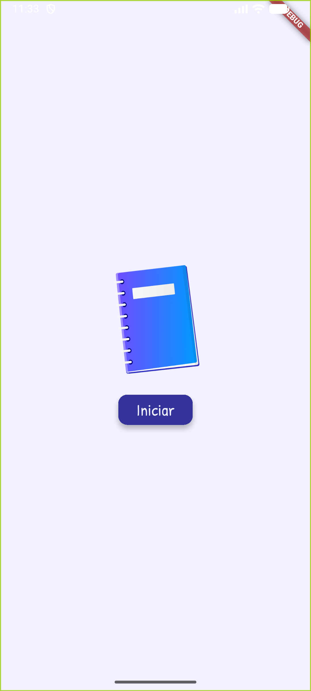
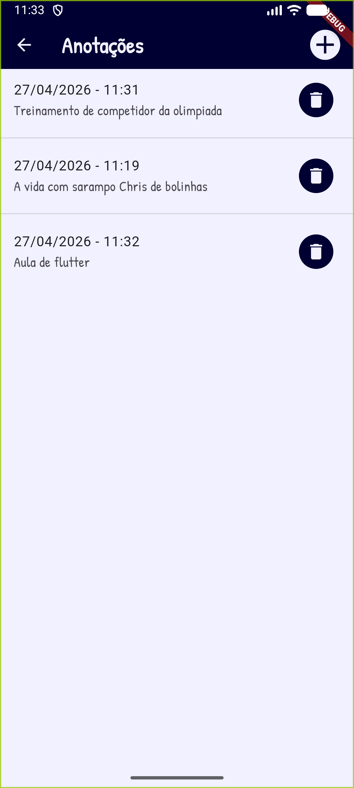

# App de Anotações

App simples em flutter de um bloco de anotações para diversos assuntos, criado para estudos e aulas de programação Mobile.

- Funcionalidade CRUD com arquivo de texto CSV

## Tecnologias
- Flutter
- VsCode
- Android Studio

|Temas|WidGets|
|-|:-:|
|Tema|ThemeData.light().copyWith()|
|Imagens|Image.asset(), Icon()|
|Assincronicidade|async|
|Carregar e salvar dados em Arquivo local|path_provider|
|Conversão de dados, classe Model de MVC|CSV|
|Utilização de fontes de texto externas .ttf|assets/fonts|
|Botões de controle de conteúdos em tela|ElevatedButton()|
|Animação|Splash Screen, Transform.rotate e opacidade|

## Para testar
- 1 Clone o repositório
- 2 Abra com VsCode, Abra o trminal **CTRL + "**, execute o comando `flutter pub get` para instalar as dependências
- 3 Navegue até o arquivo lib/main.dart e dê **play** ou execute o comando `flutter run` para rodar o projeto
- 4 Escolha navegador ou um emulador para testar, ou abra o arquivo */lib/main.dart* e clique em Play.

## Print das telas

|||
|:-:|:-:|
|Splash|Home CRUD de Anotações|

## [Download APK](./assets/app-release.apk)

## Atividade
### Desafio 01
Dê **fork** neste repositório, altere o armazenamento interno de **File** para **SQLite** e faça **commit** da alteração para o seu repositório, não é necessário fazer **pull request**

## Desafio 02
Crie um app semelhante, porém de agenda de compromissos, utilize date