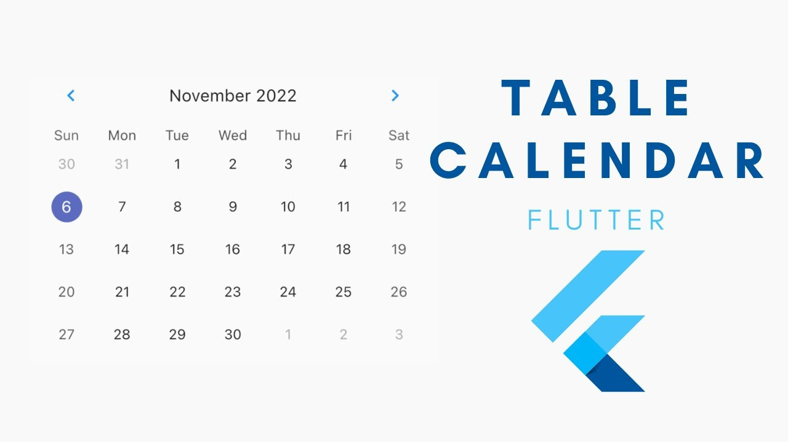

# Calendario
Usar um calendário no Flutter pode ser feito de duas formas principais: usando o seletor nativo do Material Design (showDatePicker) para seleções rápidas, ou pacotes externos como o table_calendar para uma interface de calendário completa e visual.
## Usando showDatePicker
O showDatePicker é uma função que exibe um seletor de data nativo. Ele é fácil de usar e ideal para seleções rápidas. Aqui está um exemplo básico:
```dart
import 'package:flutter/material.dart';
void main() {
  runApp(MyApp());
}

class MyApp extends StatelessWidget {
  @override
  Widget build(BuildContext context) {
    return MaterialApp(
      home: Scaffold(
        appBar: AppBar(title: Text('Date Picker Example')),
        body: Center(
          child: ElevatedButton(
            onPressed: () async {
              DateTime? pickedDate = await showDatePicker(
                context: context,
                initialDate: DateTime.now(),
                firstDate: DateTime(2000),
                lastDate: DateTime(2101),
              );
              if (pickedDate != null) {
                print('Selected date: ${pickedDate.toString()}');
              }
            },
            child: Text('Select Date'),
          ),
        ),
      ),
    );
  }
}
```

## Seletor de Data Nativo (Material Design)
Ideal para formulários onde o usuário precisa selecionar uma data. 
- Use a função showDatePicker para exibir um calendário popover.
- Requer context, initialDate, firstDate (data mais antiga) e lastDate (data mais recente).
- O valor de retorno é um Future<DateTime?>

```dart
Future<void> _selectDate(BuildContext context) async {
  final DateTime? picked = await showDatePicker(
    context: context,
    initialDate: DateTime.now(),
    firstDate: DateTime(2000),
    lastDate: DateTime(2100),
  );
  if (picked != null && picked != selectedDate)
    setState(() {
      selectedDate = picked;
    });
}
```

## Usando table_calendar
-
O table_calendar é um pacote Flutter que oferece uma interface de calendário completa e personalizável. Ele é ideal para exibir eventos, compromissos ou qualquer tipo de dados relacionados a datas. Para usar o table_calendar, siga os passos abaixo:
- 1 Adicione a dependência no pubspec.yaml:
```yaml
dependencies:
  flutter:
    sdk: flutter
  table_calendar: ^3.0.0
```
- 2 Importe o pacote e use o widget TableCalendar:
```dart
import 'package:flutter/material.dart';

void main() {
  runApp(MyApp());
}

class MyApp extends StatelessWidget {
  @override
  Widget build(BuildContext context) {
    return MaterialApp(
      home: Scaffold(
        appBar: AppBar(title: Text('Table Calendar Example')),
        body: TableCalendar(
          firstDay: DateTime.utc(2020, 1, 1),
          lastDay: DateTime.utc(2030, 12, 31),
          focusedDay: DateTime.now(),
        ),
      ),
    );
  }
}
```

Outro exemplo
```dart
TableCalendar(
  firstDay: DateTime.utc(2020, 1, 1),
  lastDay: DateTime.utc(2030, 12, 31),
  focusedDay: _focusedDay,
  calendarFormat: _calendarFormat, // Ex: CalendarFormat.month
  selectedDayPredicate: (day) {
    return isSameDay(_selectedDay, day);
  },
  onDaySelected: (selectedDay, focusedDay) {
    setState(() {
      _selectedDay = selectedDay;
      _focusedDay = focusedDay; // Atualiza o dia focado
    });
  },
  onFormatChanged: (format) {
    setState(() {
      _calendarFormat = format;
    });
  },
)
```
- O TableCalendar oferece várias opções de personalização, como estilos, formatação de datas, e callbacks para eventos de seleção de dia e mudança de formato.
- Ele é ideal para aplicativos que precisam exibir um calendário visual, como agendas, planejadores ou aplicativos de eventos.

## Integração com Google Agenda
Para integrar o Google Agenda em um aplicativo Flutter, você pode usar a API do Google Calendar. Isso envolve autenticação com OAuth 2.0 e chamadas à API para ler, criar ou modificar eventos no calendário do usuário. Aqui estão os passos básicos para começar:
- 1 Configure um projeto no Google Cloud Console e habilite a API do Google Calendar.
- 2 Adicione as credenciais de OAuth 2.0 para autenticação.
- 3 Use um pacote Flutter como google_sign_in para autenticar o usuário e obter um token de acesso.
- 4 Faça chamadas à API do Google Calendar usando o pacote http ou um cliente de API específico para Dart, como googleapis.
```dart
import 'package:google_sign_in/google_sign_in.dart';
import 'package:http/http.dart' as http;

final GoogleSignIn _googleSignIn = GoogleSignIn(
  scopes: [
    'https://www.googleapis.com/auth/calendar',
  ],
);

Future<void> _handleSignIn() async {
  try {
    await _googleSignIn.signIn();
    final GoogleSignInAuthentication auth = await _googleSignIn.currentUser!.authentication;
    final String accessToken = auth.accessToken!;
    
    // Use o accessToken para fazer chamadas à API do Google Calendar
    final response = await http.get(
      Uri.parse('https://www.googleapis.com/calendar/v3/calendars/primary/events'),
      headers: {
        'Authorization': 'Bearer $accessToken',
      },
    );
    
    if (response.statusCode == 200) {
      print('Eventos do calendário: ${response.body}');
    } else {
      print('Erro ao acessar o calendário: ${response.statusCode}');
    }
  } catch (error) {
    print('Erro de autenticação: $error');
  }
}
```
- Este exemplo mostra como autenticar o usuário usando Google Sign-In e obter um token de acesso para fazer chamadas à API do Google Calendar. Você pode expandir isso para criar, atualizar ou excluir eventos conforme necessário.