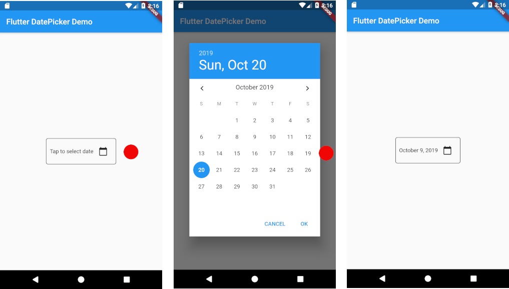

# DatePicker
Usar um DatePicker no Flutter é simples, utilizando a função nativa showDatePicker. Ela exibe um calendário modal que permite ao usuário selecionar uma data e retorna essa data para o seu código. 
- 
## Passo a passo de como implementar.
### 1. Implementação Básica
Para abrir o calendário, você geralmente usa um ElevatedButton ou IconButton dentro de uma função assíncrona (async/await). 
```dart
DateTime? _dataSelecionada;

Future<void> _selecionarData(BuildContext context) async {
  final DateTime? picked = await showDatePicker(
    context: context,
    initialDate: DateTime.now(), // Data que aparece inicialmente
    firstDate: DateTime(2000),   // Data mínima
    lastDate: DateTime(2100),    // Data máxima
  );
  
  if (picked != null && picked != _dataSelecionada) {
    setState(() {
      _dataSelecionada = picked; // Atualiza o estado com a data escolhida
    });
  }
}
```

### 2. Exibindo a Data Selecionada
Depois de selecionar a data, você pode exibi-la em um Text widget ou em qualquer outro lugar da sua interface. 
```dart
Text(
  _dataSelecionada == null 
    ? 'Nenhuma data selecionada' 
    : 'Data selecionada: ${_dataSelecionada!.toLocal()}'.split(' ')[0],
),
```